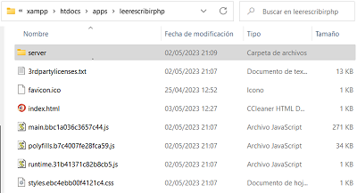
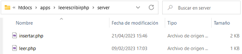

# Leerescribirphp

## Publicar el proyecto

Si lo vamos a desplegar en una carpeta dentro de htdocs llamada por ejemplo: 

`/apps/leerescribirphp/`

Al compilar, se puede escribir:

`ng build --base-href=/apps/leerescribirphp/`

O bien después de compilar, se edita el fichro `index.html`

```html
<!DOCTYPE html>
<html lang="es">
  <head>
    <meta charset="utf-8" />
    <title>Leerescribirphp</title>
    <base href="/apps/leerescribirphp/" />
    <meta name="viewport" content="width=device-width, initial-scale=1" />
    <link rel="icon" type="image/x-icon" href="favicon.ico" />
    <style>
      @import "https://cdn.jsdelivr.net/npm/bootstrap@5.2.3/dist/css/bootstrap.min.css";
    </style>
    <link
      rel="stylesheet"
      href="styles.ebc4ebb00f4121c4.css"
      media="print"
      onload="this.media='all'"
    />
    <noscript
      ><link rel="stylesheet" href="styles.ebc4ebb00f4121c4.css"
    /></noscript>
  </head>
  <body>
    <app-root></app-root>
    <script src="runtime.31b41371c82b8cb5.js" type="module"></script>
    <script src="polyfills.b7c4007fe28fca59.js" type="module"></script>
    <script src="main.bbc1a036c3657c44.js" type="module"></script>
  </body>
</html>
```

Hay que tener también en cuenta que las peticiones dentro del código debe hacerse a la API del servidor real. En este caso tengo una carpeta dentro de apps llamada server donde añadiré el código php.

```typescript
export class ServicioService {

  url:string='http://localhost/apps/leerescribirphp/server/';

  constructor(private http: HttpClient) { }

  getDatos():  Observable<Usuarios[]> {
    return this.http.get<Usuarios[]>(`${this.url}leer.php`);
  }

  postDato(nuevo:Usuarios): Observable<Usuarios> {
    return this.http.post<Usuarios>(`${this.url}insertar.php`,nuevo);
  }
}
```

No es obligatorio que server esté dentro de la carpeta de la app cliente, de hecho no suele ser lo habitual, en este caso la pongo para tenerlo todo más controlado dentro de la misma carpeta:  





This project was generated with [Angular CLI](https://github.com/angular/angular-cli) version 15.2.4.

## Development server

Run `ng serve` for a dev server. Navigate to `http://localhost:4200/`. The application will automatically reload if you change any of the source files.

## Code scaffolding

Run `ng generate component component-name` to generate a new component. You can also use `ng generate directive|pipe|service|class|guard|interface|enum|module`.

## Build

Run `ng build` to build the project. The build artifacts will be stored in the `dist/` directory.

## Running unit tests

Run `ng test` to execute the unit tests via [Karma](https://karma-runner.github.io).

## Running end-to-end tests

Run `ng e2e` to execute the end-to-end tests via a platform of your choice. To use this command, you need to first add a package that implements end-to-end testing capabilities.

## Further help

To get more help on the Angular CLI use `ng help` or go check out the [Angular CLI Overview and Command Reference](https://angular.io/cli) page.
